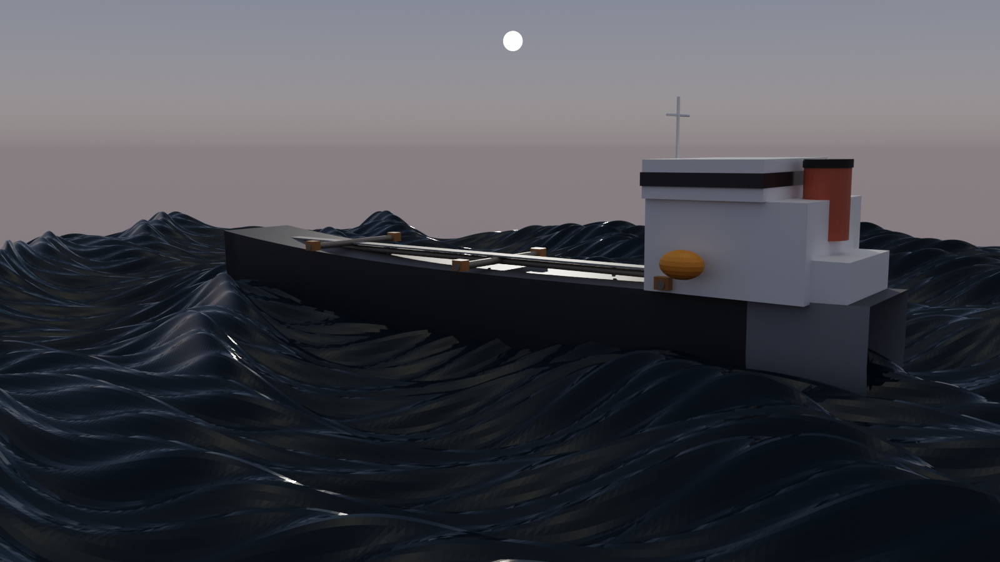
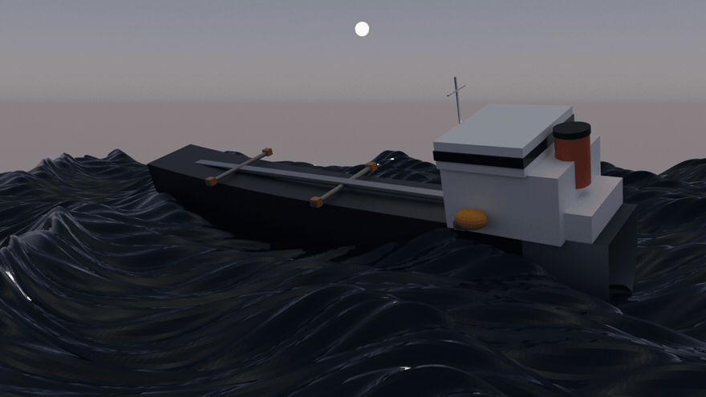
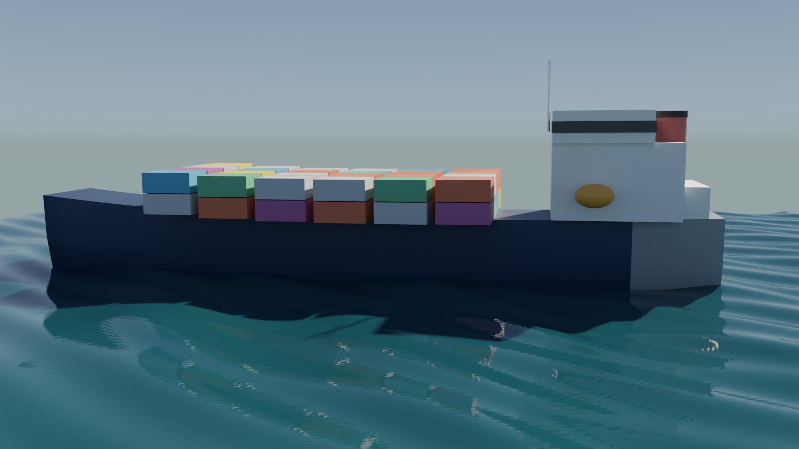
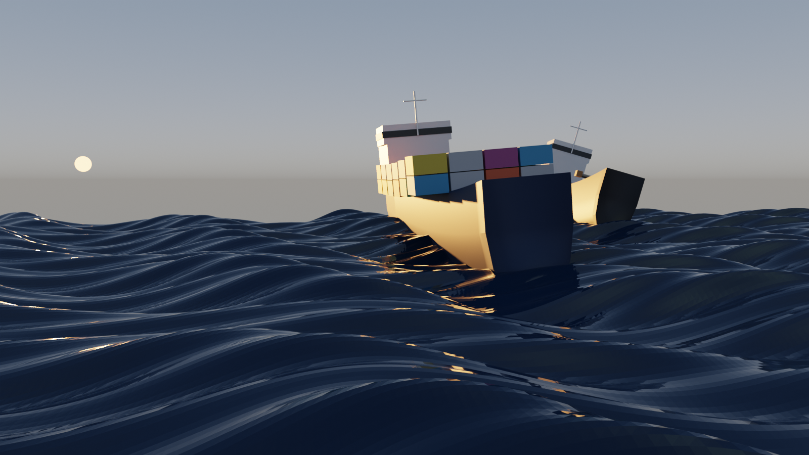

# 🚢 ship-cinema

**EN:** Ships sailing on the **real ocean physics** from [`ocean-cinema`](https://github.com/efealtiparmakoglu/ocean-cinema) — the Gerstner wave field is sampled at bow/stern/port/starboard and the hull **heaves, pitches and rolls** with the actual surface. Now in **two engines**: procedural 3D ships rendered in Blender Cycles, and the original 2D silhouette GIFs.

**TR:** ocean-cinema'nın Gerstner dalga alanında yüzen gemiler — pruva/kıç/iskele/sancak noktalarından alınan 4 örnek, gemiye gerçek heave + pitch + roll kazandırır. **İki motor**: Blender Cycles'ta prosedürel 3B gemiler ve klasik 2B siluet GIF'leri.



## 🖼️ Gallery / Galeri

### ⚡ Tanker / Fırtına — 3B Cycles

Black-water storm: five wave trains under a turbid sky, the tanker rolling on the swell. — *Kara sular fırtınası: bulanık gök altında beş dalga treni, tanker denizde yalpalanıyor.*


*36-frame Cycles animation — every frame re-solves the Gerstner field.* — *Her karede Gerstner alanı yeniden çözülür.*

### 🏝️ Kargo / Tropikal — 3B Cycles

Container ship on teal tropical water, two-tier colored boxes on deck. — *Turkuaz tropikal suda konteyner gemisi, güvertede iki kat renkli yük.*

### 🌅 Konvoy / Gün Batımı — 3B Cycles

Two ships in convoy at golden hour, sun disk on the horizon. — *Altın saatte konvoyda iki gemi, ufukta güneş diski.*

### 🎞️ 2B motor — klasik GIF'ler (`gemi.py`)

| | | |
|---|---|---|
|  |  |  |
| 🏝️ Kargo sakin | ⚡ Tanker fırtına | 🌅 Gün batımı konvoyu |

## 🧱 How it works / Nasıl çalışır

```
ocean-cinema Gerstner alanı (ω = √(gk), aynı formüller)
        ↓  deniz3d.py: pruva/kıç/iskele/sancak örneklemesi
   heave + pitch + roll
        ↓
gemi3d.py: 26 istasyonlu loft gövde (kapalı kesitler, kırmızı su altı,
           sheer'li güverte) + köprüüstü, baca, konteyner/boru yükü
        ↓
gemi_render.py: ocean-cinema'nın Cycles denizi + güneş/ay diski,
           her karede alan yeniden çözülür → render
```

## 🚀 Usage / Kullanım

```bash
# ocean-cinema repoyu yan yana klonla (import yolu ona gore)
git clone https://github.com/efealtiparmakoglu/ocean-cinema ../ocean-cinema
git clone https://github.com/efealtiparmakoglu/ship-cinema
cd ship-cinema

# 3B Cycles sahne (Blender 4.2+ / 5.x)
blender --background --python gemi_render.py -- --scene scenes3d/tanker_firtina.json
HIZLI=1 blender --background --python gemi_render.py -- --scene scenes3d/kargo_tropikal.json  # onizleme
blender --background --python gemi_render.py -- --scene scenes3d/tanker_firtina.json --gif 36 --fps 12

# 2B motor
pip install numpy
python3 gemi.py --scene scenes/tanker_firtina.json
```

Sahne JSON'u = ocean-cinema sahne formatı + `ships` (tip/pos/heading/boy) + `float` (amplitude_scale) blokları.

## 🧪 Why / Neden

**TR:** Gemi silüeti dalganın ÜSTÜNDE kayan bir resimdir; bu projede gemi, dalga alanının içindeki bir cisim: dört noktadan örneklenen yüzey gemiyi kaldırır, eğar, yatırır. Gövde kutu yığını değil, kesitlerin loft'landığı su hattı kırmızı bir tekne. Denizle gemi aynı fizikten beslenir — iki repo, tek evren.

## 📄 License

MIT
