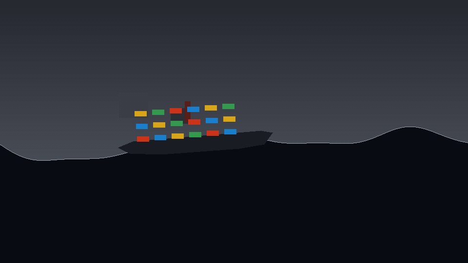
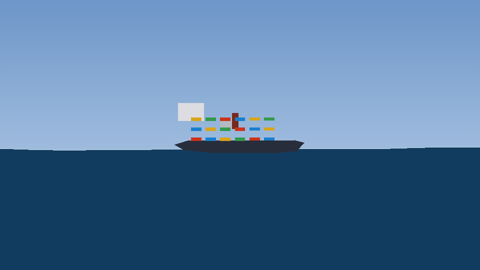
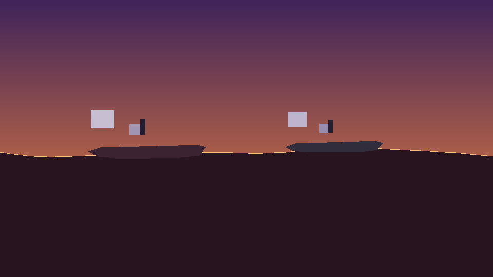

# 🚢 ship-cinema

**EN:** Ships sailing on the **real ocean physics** from [`ocean-cinema`](https://github.com/efealtiparmakoglu/ocean-cinema) — this project **imports the Gerstner wave engine** and makes ships ride it: hulls heave with the swell and pitch with the wave slope, sampled from the actual wave field at bow/mid/stern.

**TR:** ocean-cinema'nın Gerstner dalga motorunu import eden gemi simülatörü — gemiler, deniz yüzeyini pruva/orta/kıç noktalarından örnekleyerek heave + pitch yapar; dalgalar gemiyi gerçekten taşır.



## 🖼️ Gallery / Galeri

### 🚢 Kargo — sakin sefer


### ⚡ Tanker / Fırtına


### 🌅 Günbatımı Konvoyu


## 🧱 How it works / Nasıl çalışır

```
ocean-cinema/ocean.py  →  GerstnerDenizi.yukseklik(x, t)  →  deniz yuzeyi
                                   ↓
          pruva / orta / kic ornekleme  →  heave + pitch
                                   ↓
          gemi silueti cizimi (scanline dolgu, konteynerler, baca, bayrak)
```

## 🚀 Usage / Kullanım

```bash
# ocean-cinema repoyu yan yana klonla (import yolu ona gore)
git clone https://github.com/efealtiparmakoglu/ocean-cinema ../ocean-cinema
git clone https://github.com/efealtiparmakoglu/ship-cinema
cd ship-cinema
python3 gemi.py --scene scenes/kargo_sakin.json
```

## 📄 License

MIT
